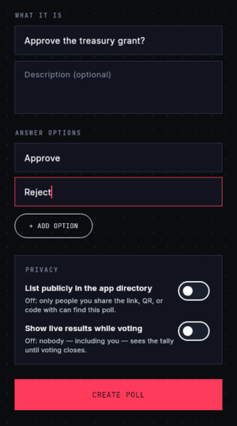
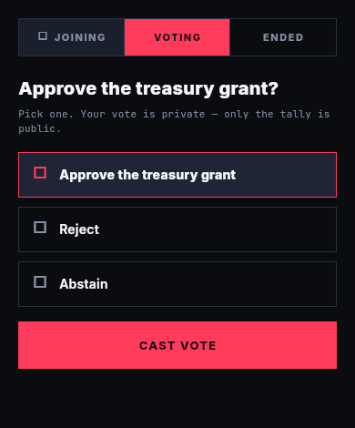
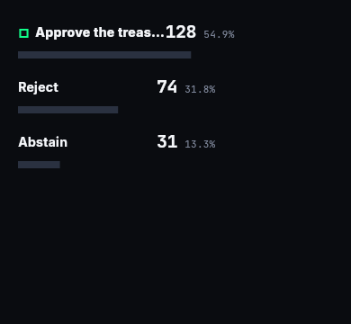
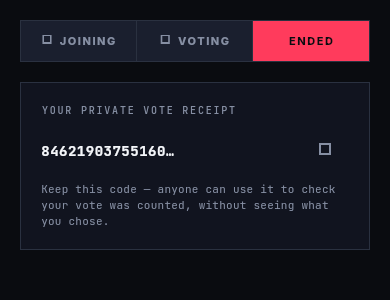
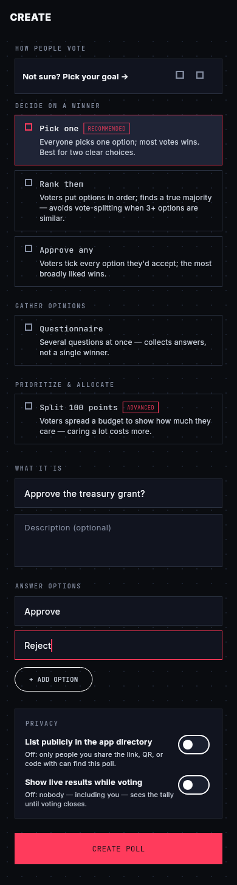
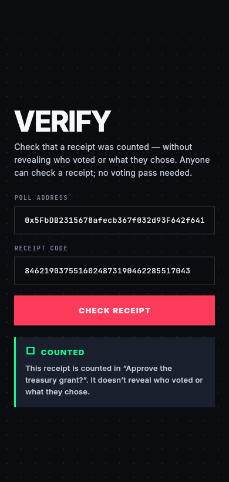
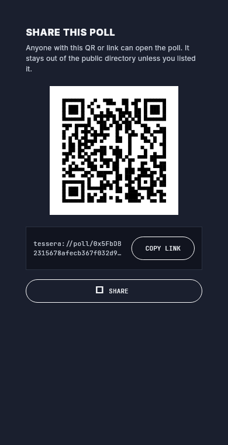

# Tessera

**Let a group make a decision everyone can trust — and check the result is honest without trusting whoever ran it.**

Tessera is open-source software a community **self-hosts**: a verifiable bulletin
board for group decisions (a club, a co-op, a DAO, a student org, a board). One
server holds an **append-only ballot log**; the log's checkpoints are pinned to a
**public, host-independent anchor**, so anyone can recompute the tally from the
published ballots and confirm it matches the anchored record. Secret ballots use
**blind-signature credentials** — no blockchain, no ZK proofs, no wallet.

It is **not** trustless. It spends a bounded trust in the organiser (for
integrity) to buy enormous simplicity, and backs that trust with public
verifiability — *trust the organiser to run the vote, prove the count to
everyone.*

<p align="center">
  
  <br />
  <em>create → vote → results → verify · <a href="docs/images/demo.mp4">mp4</a></em>
</p>

## Screenshots

| Cast a private ballot | Live results | Your private receipt |
| :---: | :---: | :---: |
|  |  |  |

| Create a decision | Verify it counted | Share &amp; invite |
| :---: | :---: | :---: |
|  |  |  |

> These are real frames rendered headlessly from the Flutter client's golden
> visual-audit harness (`codes/app/apps/tessera/test/golden/`), not mockups.

## At a glance

| Component | Path | Purpose |
| --- | --- | --- |
| **Server** | [`codes/server/`](codes/server/) | Self-hosted core: SQLite append-only ballot log, decision lifecycle + convener auth, the five-method **tally + verdict** oracle, idempotent casts with server-signed **hash-chained receipts**, and the public read API. |
| **Trust core** | [`codes/server/src/`](codes/server/src/) | RFC 6962 Merkle log + Ed25519-signed checkpoints, a pluggable **anchor** (broadcast by default, a public chain as the equivocation-resistant upgrade), and the **independent public verifier** (six checks, pure code, depends only on public data). |
| **Secret ballots** | [`credentials`](codes/server/src/credentials/) · [`core_crypto`](codes/app/packages/core_crypto/) | RFC 9474 **RSABSSA** blind-signature credentials — a server-side issuer plus a pure-Dart client — so a ballot is eligibility-gated **and** anonymous. |
| **Client (Tessera)** | [`codes/app/`](codes/app/) | One Flutter codebase (web-first; also desktop/mobile) — the voter, convener, and verifier UI. |
| **Control plane** | [`codes/control/`](codes/control/) | Multi-tenant operator: one isolated server per org (own container, DB, signing key). It only routes and supervises — it never holds ballot data or tenant keys. |
| **Docs** | [`docs/`](docs/) | Architecture map, the canonical design spec, roadmap, and status. |

## How it works

A community runs one **server** that appends every cast ballot to a log it cannot
silently rewrite: receipts are a signed hash-chain over the running log, and the
log's RFC 6962 Merkle roots are posted to a **public anchor** the host doesn't
control. Anyone — a voter, a member, an outside observer — can pull the published
ballots and run the **verifier**, which recomputes the tally *and the verdict*,
recomputes the Merkle root and binds it to the anchored root, and checks
credential serials and inclusion. Secret ballots stay anonymous because the
credential is a blind RSA signature: the server signs a token it cannot read.

Voting methods (pure off-chain tally, recomputable by any verifier): **pick-one ·
approve-any · ranked (IRV) · quadratic · multi-question survey**, plus
abstain / none-of-the-above. Ballot mode (open / secret) and results policy
(live / sealed-until-close) are orthogonal — the board/DAO default is
secret + sealed.

## Threat model (honest)

The organiser is **trusted for integrity but checked** — and the docs are
deliberate about where "checked" has teeth and where it reduces to trust.

- **Holds even against a malicious host** — tally correctness (anyone
  recomputes), ballot-set tamper-evidence after acknowledgement (hash-chained
  receipts + anchored roots), and setup immutability (anchored commitment).
- **Rests on host honesty (named, not papered over)** — eligibility /
  ballot-stuffing (the host defines the roster; published / challengeable rosters
  are a detection aid, not a proof), secret-ballot privacy against a *live*
  malicious host (single-party metadata correlation), and censorship-by-silence.
- **Out of scope (by the core job)** — coercion-resistance / receipt-freeness,
  anonymity against global chain validators, nation-state availability.

The stronger guarantee — privacy *even against the host* (separate registrar ⊥
ballot box, and/or the parked Semaphore ZK credential) — is a named **post-1.0
"strong mode."** Full version: design spec §6 / §13.

## Run it

### Locally (one command)

```bash
./demo.sh up          # build + start the server, seed a demo decision, open the app
```

Under the hood that's just the self-hosted server plus the Flutter client — you
can also start the pieces by hand:

```bash
./dev-stack.sh up                                       # server on :3001 (enters the Nix devShell if needed)
(cd codes/app/apps/tessera && flutter run -d chrome)    # or -d linux
```

### Self-host (multi-tenant)

```bash
docker compose -f deploy/multi-tenant/docker-compose.yml up -d --build
```

One operator, many orgs — each a fully isolated instance (own container, DB, and
signing key). Anyone can verify a published decision against *that org's* key,
e.g. `curl http://<org>.localhost:8787/verify/<id>`. See
[`deploy/multi-tenant/README.md`](deploy/multi-tenant/README.md).

### Test

```bash
cd codes/server  && npm test     # vitest — server + trust core + verifier
cd codes/control && npm test     # vitest — control plane
cd codes/app     && dart run melos run analyze && dart run melos run test
```

## Docs

- [`docs/architecture/system-overview.md`](docs/architecture/system-overview.md) — the orientation map (components, trust model, what this replaced).
- [`docs/superpowers/specs/2026-06-19-tessera-system-design.md`](docs/superpowers/specs/2026-06-19-tessera-system-design.md) — **the canonical design**: core job, threat model, data model, the hardened verification protocol, and the honest-claims analysis.
- [`docs/project/ROADMAP.md`](docs/project/ROADMAP.md) · [`docs/project/STATUS.md`](docs/project/STATUS.md) — the Phase 0–6 path to 1.0 and where things stand.

## Status

**Pre-1.0, and honest about it.** A 2026-06-19 ground-up rethink retired the old
on-chain era — the `PollRegistry` factory, the six ZK voting modules, `ZkAirdrop`,
the Semaphore/Groth16 verifier and provers, and the gasless relayer are all gone
(preserved in git history; Semaphore ZK is *parked* as the post-1.0 strong mode).

Shipped so far: **Phase 1** (dismantle & extract), **Phase 2** (the server,
open-ballot end-to-end), **Phase 3** (trust core — blind-sig credentials, Merkle
checkpoints, the anchor adapter, and the independent verifier), and **Phase 4**
(the client rewired onto the server, plus the multi-tenant control plane). Still
ahead: **Phase 5** product completeness (result semantics, notifications,
lifecycle edits, abstain, sharing/export, WCAG-AA + i18n) and **Phase 6** 1.0
hardening (security review, durability, one-command self-host packaging). **Not
1.0 yet** — claims are kept verified-or-fenced.

Chúng em đã biết làm web và hiểu hệ thống web hoạt động như thế nào.
