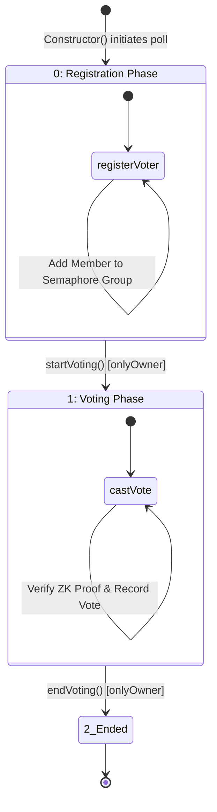
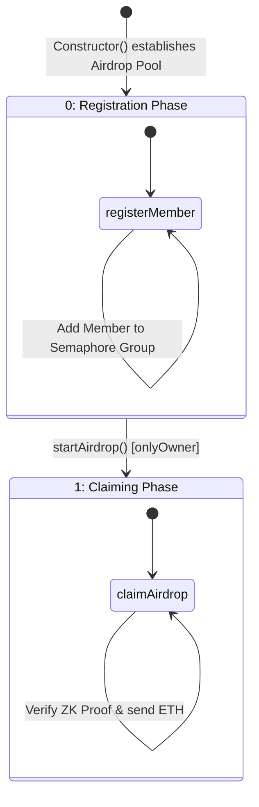

# ZK Voting & ZK Airdrop - Smart Contract Architecture Workflow

This document provides a massive, contract-centric deep dive into the split `ZkVoting.sol` and `ZkAirdrop.sol` systems.

## 1. ZkVoting.sol Architecture

The system enforces a voting timeline via the `PollState` enum.



### ZkVoting: `castVote()`
Cryptographically validates the Zero-Knowledge proof and explicitly prevents double-voting via tracking nullifier hashes.

```mermaid
flowchart TD
    Start([Call castVote]) --> StateCheck{Is State == Voting?}
    StateCheck -- No --> Revert1[Revert: "Not in voting phase"]
    
    StateCheck -- Yes --> NullCheck{Is Nullifier Used in mapping?}
    NullCheck -- Yes --> Revert2[Revert: "You have already voted"]
    
    NullCheck -- No --> ScopeCheck{Is scope == address this?}
    ScopeCheck -- No --> Revert3[Revert: "Invalid scope"]
    
    ScopeCheck -- Yes --> MsgCheck{Is message == vote candidate ID?}
    MsgCheck -- No --> Revert4[Revert: "Tampered vote signal"]
    
    MsgCheck -- Yes --> ZKVerify[Call semaphore.verifyProof]
    
    ZKVerify --> IsZKValid{Is ISemaphore proof valid?}
    IsZKValid -- No --> Revert5[Revert: "Invalid ZK proof"]
    
    IsZKValid -- Yes --> RecordNull[Set isNullifierUsed proof.nullifier = true]
    RecordNull --> Tally[Increment voteCounts]
    Tally --> Emit[Emit VoteCast Event]
    Emit --> End([Transaction Success])
    
    classDef revert fill:#ffebee,stroke:#c62828,color:#b71c1c
    class Revert1,Revert2,Revert3,Revert4,Revert5 revert
```

---

## 2. ZkAirdrop.sol Architecture

Following the removal of the weak pseudo-random lottery, the `ZkAirdrop.sol` system provides a mathematically sound whitelist-claiming protocol.



### ZkAirdrop: `claimAirdrop()`
The winning action. Any registered group member can generate exactly 1 proof binding their airdrop claim to a completely disconnected payout address, without revealing *which* leaf they are in the underlying Merkle Tree.

```mermaid
flowchart TD
    Start([Call claimAirdrop]) --> StateCheck{Is State == Claiming?}
    StateCheck -- No --> Revert1[Revert: "Not in claiming phase"]
    
    StateCheck -- Yes --> ClaimCheck{Is Nullifier already used?}
    ClaimCheck -- Yes --> Revert2[Revert: "Airdrop already claimed by this identity"]
    
    ClaimCheck -- No --> ScopeCheck{Is proof.scope == address this?}
    ScopeCheck -- No --> Revert3[Revert: "Invalid claim scope"]
    
    ScopeCheck -- Yes --> MsgCheck{Is proof.message == receiver address?}
    MsgCheck -- No --> Revert4[Revert: "Receiver mismatch"]
    
    MsgCheck -- Yes --> ZKVerify[Call semaphore.verifyProof]
    ZKVerify --> ValidZK{Is ISemaphore proof valid?}
    
    ValidZK -- No --> Revert5[Revert: "Invalid claim proof"]
    
    ValidZK -- Yes --> Mark[Set isNullifierUsed = true]
    Mark --> Emit[Emit AirdropClaimed]
    Emit --> Transfer[receiver.call value: airdropAmount]
    Transfer --> TransferSuccess{Did transfer succeed?}
    TransferSuccess -- No --> Revert6[Revert: "Failed to send ETH"]
    TransferSuccess -- Yes --> End([Transaction Success])
    
    classDef revert fill:#ffebee,stroke:#c62828,color:#b71c1c
    class Revert1,Revert2,Revert3,Revert4,Revert5,Revert6 revert
```
